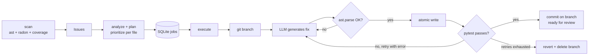

# Autodev — The Self-Improving Codebase


Autodev is a codebase that maintains itself. It scans Python source for quality
issues, turns them into prioritized improvement jobs, asks an LLM to write the
fix on an isolated git branch, runs the test suite, and **commits only what
passes** — failed attempts are reverted and their branches deleted. Humans stay
in the loop: autodev proposes branches, you merge them.

**Why?** Code quality work (tests, docstrings, refactoring hot spots) is
important but perpetually deprioritized. Autodev turns it into a background
process, with a full audit trail in SQLite and git.

## How it works



Issue priorities: missing tests = **critical**, cyclomatic complexity > 10 or
functions > 50 lines = **high**, missing docstrings = **medium**, missing type
hints = **low**.

## Quick start

```bash
git clone https://github.com/USER/autodev.git && cd autodev
uv sync                      # or: pip install -e .

uv run autodev init          # writes a .env template
uv run autodev scan          # find issues, record metrics
uv run autodev plan          # queue improvement jobs
uv run autodev execute --max-jobs 3   # let it fix things
uv run autodev status        # see what happened
git branch --list "autodev/*"         # review proposed branches
```

Continuous mode and dashboard:

```bash
uv run autodev loop --interval 3600   # scan -> plan -> execute forever
uv run autodev dashboard              # web UI at http://localhost:8000
```

## Configuration

Everything is configured via `AUTODEV_*` environment variables or a `.env`
file (see [.env.example](.env.example)). The default provider is **Ollama**,
so autodev runs fully local and free — no API key required.

| Variable | Default | Purpose |
|---|---|---|
| `AUTODEV_LLM_PROVIDER` | `ollama` | `anthropic`, `openai`, `ollama`, or `mock` |
| `AUTODEV_API_KEY` | — | key for hosted providers |
| `AUTODEV_MODEL` | provider default | e.g. `claude-sonnet-5`, `gpt-4o-mini`, `qwen2.5-coder:7b` |
| `AUTODEV_BASE_URL` | provider default | Ollama host or any OpenAI-compatible endpoint |
| `AUTODEV_MAX_TOKENS` | `4096` | generation budget |
| `AUTODEV_DB_PATH` | `autodev.db` | SQLite state location |
| `AUTODEV_REPO_PATH` | `.` | repository to maintain |
| `AUTODEV_SRC_DIR` / `AUTODEV_TESTS_DIR` | `src` / `tests` | layout of the target repo |
| `AUTODEV_MAX_JOBS_PER_RUN` | `3` | throttle per execute/loop cycle |

### LLM providers

- **Ollama** (default): start `ollama serve`, pull a code model
  (`ollama pull qwen2.5-coder:7b`), done.
- **Anthropic**: `AUTODEV_LLM_PROVIDER=anthropic`, `AUTODEV_API_KEY=sk-ant-...`
- **OpenAI / compatible**: `AUTODEV_LLM_PROVIDER=openai` plus key; point
  `AUTODEV_BASE_URL` at any OpenAI-compatible server (vLLM, LM Studio, ...).
- **Mock**: offline canned responses, used by the test suite.

## CLI reference

| Command | What it does |
|---|---|
| `autodev init` | write a `.env` template |
| `autodev scan` | detect issues, record per-file metrics |
| `autodev plan` | queue improvement jobs from scan results |
| `autodev execute --max-jobs N` | run pending jobs (branch → fix → test → commit) |
| `autodev loop --interval S` | continuous scan/plan/execute |
| `autodev dashboard` | FastAPI web UI (jobs, metrics chart, diffs) |
| `autodev status` | pending/completed counts, average coverage |
| `autodev review` | LLM code-review of the latest completed job's diff |

## Web dashboard

`autodev dashboard` serves a dark-mode UI at `localhost:8000`: job table with
status badges, per-file coverage/complexity chart, colorized diffs per job, and
a "Trigger Scan" button.

*(screenshots: see `docs/` — placeholder)*

## Docker

```bash
cp .env.example .env
docker compose up --build        # loop service + dashboard on :8000
```

The compose file mounts the repository into the container at `/workspace`, so
the container maintains the very codebase it ships in. A host-side Ollama is
reachable via `host.docker.internal`.

## Self-Improvement Demo

*(filled in by Phase 8 — see docs/PROGRESS.md)*

## Development

```bash
uv sync
uv run pytest --cov=src/autodev --cov-report=term-missing
uv run ruff check src tests
```

Architecture details live in [docs/ARCHITECTURE.md](docs/ARCHITECTURE.md).
State: two SQLite tables (`jobs`, `metrics`) — no ORM, no migrations, no
ceremony.

## License

MIT
